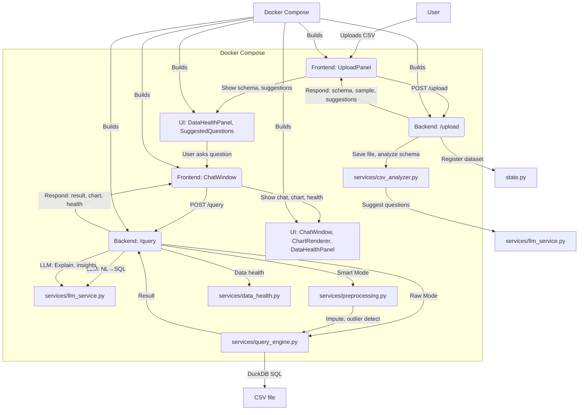

# 🧠 Talk to Data — AI-Powered CSV Query Engine

> Upload a CSV, ask questions in plain English, get SQL-backed answers with interactive charts, SQL Guardian protection, and drill-down data health insights.

---

<details>
<summary><strong>📦 System & Docker Architecture (click to expand)</strong></summary>

### 🐳 Docker Compose Setup

<p align="center">

</p>

#### Services:

- <strong>backend</strong>: Python 3.11, FastAPI, DuckDB, Groq LLM, all data/AI logic
  - Mounts <code>./backend/uploads</code> for persistent CSV storage
  - Exposes <code>8000</code> (API)
- <strong>frontend</strong>: React 19, Vite, Recharts, glassmorphism UI
  - Exposes <code>5173</code> (UI)
  - Proxies API to backend

#### docker-compose.yml

```yaml
services:
  backend:
    build: ./backend
    ports: ["8000:8000"]
    volumes:
      - ./backend/uploads:/app/uploads
    env_file:
      - ./backend/.env
    restart: unless-stopped
  frontend:
    build: ./frontend
    ports: ["5173:5173"]
    environment:
      VITE_PROXY_TARGET: http://backend:8000
    depends_on:
      - backend
    restart: unless-stopped
```

#### Container Flow

<div align="center">



</div>

<!-- Nitya do something -->

</details>

## 🚀 Quick Start

### Prerequisites

- Python 3.11+
- Node.js 18+
- A **Groq API key** from [console.groq.com](https://console.groq.com)

### 1. Backend Setup

```bash
cd backend

# Copy env file and add your Groq key
copy .env.example .env
# Edit .env → set GROQ_API_KEY=your_actual_key_here

# Install dependencies
pip install -r requirements.txt

# Start backend
uvicorn main:app --reload --host 0.0.0.0 --port 8000
```

Backend runs at → `http://localhost:8000`  
Swagger docs → `http://localhost:8000/docs`

### 2. Frontend Setup

```bash
cd frontend

# Install dependencies
npm install

# Start frontend
npm run dev
```

Frontend runs at → `http://localhost:5173`

---

### 3. Docker setup

```bash
docker compose up --build
```

## 🏗️ Project Structure

```
natwest hackathon/
├── backend/
│   ├── main.py                   # FastAPI app entry
│   ├── state.py                  # In-memory dataset/session registry
│   ├── requirements.txt
│   ├── .env                      # GROQ_API_KEY (do not commit)
│   ├── uploads/                  # Saved CSV files
│   ├── models/
│   │   └── schemas.py            # Pydantic request/response models
│   ├── routers/
│   │   ├── upload.py             # POST /upload
│   │   └── query.py              # POST /query
│   └── services/
│       ├── csv_analyzer.py       # DuckDB schema + stats extraction
│       ├── llm_service.py        # Groq: NL→SQL + explanation
│       ├── query_engine.py       # DuckDB SQL execution
│       ├── preprocessing.py      # Smart Mode: imputation + outlier detection
│       └── data_health.py        # Health metrics + confidence score
│
└── frontend/
    ├── index.html
    ├── vite.config.js            # Proxy → localhost:8000
    └── src/
        ├── main.jsx
        ├── App.jsx               # Root: sidebar + chat layout
        ├── index.css             # Glassmorphism design system
        ├── api/client.js         # fetch wrappers for /upload and /query
        ├── hooks/useChat.js      # Chat state + session memory
        └── components/
            ├── UploadPanel.jsx   # Drag-drop CSV + schema viewer
            ├── ModeToggle.jsx    # Raw / Smart / Scalable toggle
            ├── ChatWindow.jsx    # Scrollable messages + input bar
            ├── MessageBubble.jsx # User & AI response cards
            ├── DataHealthPanel.jsx # Missing%, outliers, confidence + drill-down
            ├── ChartRenderer.jsx # Interactive chart builder + heatmap
            ├── ResultTable.jsx   # Scrollable data table
            └── SuggestedQuestions.jsx # LLM-generated question list
```

---

## 🧩 Architecture

```
User Query
    │
    ▼
LLM (Groq) — NL → SQL
(Schema + 5 sample rows sent — NEVER full dataset)
    │
    ▼
SQL Guardian (multi-stage safety)
  • Static SELECT-only validation
  • Semantic SQL review
  • Dry-run/repair loop (up to retry limit)
  │
  ▼
DuckDB — Execute SQL
    │
    ├── Raw Mode  → Direct execution on original data
    │                Note: "Results based on raw data"
    │
    └── Smart Mode → Preprocessing first:
                      • Null detection + imputation (mean/median/mode)
                      • IQR outlier detection
                      • Transparency log generated
    │
    ▼
Data Health Panel (+ Drill-down)
    • Missing value %
    • Outlier count
    • Rows used
    • Confidence score (0-100)
  • Confidence reasons + penalty breakdown
  • Flagged columns + summary
    │
    ▼
LLM (Groq) — Explanation + Insights + "Why?"
    │
    ▼
Frontend: Chat + Interactive Chart Builder + Health Panel + Guardian Panel + Preprocessing Log
```

---

## 🔌 API Reference

### `POST /upload`

Upload a CSV file. Returns schema, statistics, and LLM-suggested questions.

**Request:** `multipart/form-data` — `file: <csv>`

**Response:**

```json
{
  "dataset_id": "uuid",
  "filename": "sales.csv",
  "row_count": 5000,
  "columns": [
    { "name": "revenue", "type": "DOUBLE", "null_pct": 8.2, "mean": 12340.5, "min": 0, "max": 99000 }
  ],
  "sample": [...],
  "suggested_questions": ["What is total revenue by region?", ...]
}
```

### `POST /query`

Ask a natural language question about an uploaded dataset.

**Request:**

```json
{
  "dataset_id": "uuid",
  "question": "What is the average revenue by category?",
  "mode": "smart",
  "session_id": "optional-uuid-for-context-memory",
  "guardian_enabled": true
}
```

**Response:**

```json
{
  "sql": "SELECT category, AVG(revenue) FROM data GROUP BY category",
  "result": [...],
  "columns": ["category", "avg(revenue)"],
  "explanation": "Electronics leads with $45k average revenue...",
  "insights": ["Electronics: +22% vs avg", "Books: lowest performer"],
  "chart_type": "bar",
  "chart_x": "category",
  "chart_y": ["avg(revenue)"],
  "data_health": {
    "missing_pct": 8.2,
    "outliers": 3,
    "rows_used": 4960,
    "confidence": 89.0,
    "confidence_level": "good",
    "confidence_reason": ["Missingness penalty is low"],
    "penalty_breakdown": {"missing_penalty": 5.1, "outlier_penalty": 3.0},
    "column_health": [{"column": "revenue", "missing_pct": 8.2, "severity": "medium"}],
    "summary_text": "Overall healthy dataset with moderate missingness in revenue"
  },
  "preprocessing_log": ["✅ 'revenue': 8.2% nulls filled using median (skewed distribution)"],
  "mode": "smart",
  "guardian_enabled": true,
  "guardian_passed": true,
  "guardian_confidence": 0.93,
  "guardian_retries": 1,
  "guardian_log": ["Attempt 1: semantic review FAIL - bad column", "Guardian generated a repaired SQL candidate"],
  "guardian_steps": [{"attempt": 1, "stages": [{"stage": "validator", "status": "pass", "message": "Static SQL safety check passed."}]}],
  "why_analysis": "The revenue gap likely reflects seasonal demand patterns..."
}
```

---

## ✨ Features

| Feature                                            | Status |
| -------------------------------------------------- | ------ |
| CSV drag-and-drop upload                           | ✅     |
| Schema extraction (types, null%, mean/min/max)     | ✅     |
| Natural language → SQL (Groq LLM)                  | ✅     |
| DuckDB query execution                             | ✅     |
| Raw Mode (no preprocessing)                        | ✅     |
| Scalable Mode (PySpark pipeline)                   | ✅     |
| Smart Mode (auto imputation + outlier detection)   | ✅     |
| Skewness-aware imputation (mean vs median)         | ✅     |
| Robust outlier handling (IQR guard + dedup count)  | ✅     |
| Preprocessing transparency log                     | ✅     |
| Data Health drill-down (reasons/penalties/columns) | ✅     |
| Plain English explanation                          | ✅     |
| Bullet insights                                    | ✅     |
| "Why did this happen?" analysis                    | ✅     |
| SQL Guardian (validator + semantic + dry-run)      | ✅     |
| Guardian panel UX (attempt/stage expansion)        | ✅     |
| Interactive chart builder (Type/X/Y/Agg)           | ✅     |
| Chart types: bar/line/area/pie/scatter             | ✅     |
| Correlation matrix heatmap rendering               | ✅     |
| Suggested questions (LLM-generated)                | ✅     |
| Session-based context memory (follow-ups)          | ✅     |
| Dark glassmorphism UI                              | ✅     |
| Privacy-safe (only schema+5 rows to LLM)           | ✅     |

---

---

## 📸 UI Snapshots

### 🏠 Landing Page


> Upload your CSV and get started with AI-powered querying.

---

### 💬 Chat Interface


> Ask questions in plain English and get SQL-backed answers with explanations.

---

### 📊 Visualization Dashboard


> Automatically generated charts and insights from your data.

---

### 🧠 Data Health Panel


> View missing values, outliers, and confidence score.

---

### 🔍 Query + Insights Output


> Get explanations, insights, and “why” analysis for your queries.

---

## 🔒 Privacy & Safety

- **Only schema + 5 sample rows** are sent to the Groq LLM
- Full dataset stays local, queried by DuckDB
- SQL Guardian validates and repairs SQL before execution
- All executable SQL queries are enforced to be `SELECT`-only
- No data leaves your machine except the schema summary

---

## 🛠️ Tech Stack

| Layer       | Technology                  |
| ----------- | --------------------------- |
| Backend     | Python 3.11 + FastAPI       |
| Data Engine | DuckDB 0.10                 |
| LLM         | Groq (llama3-70b-8192)      |
| Frontend    | React 19 + Vite 8           |
| Charts      | Recharts                    |
| Icons       | Lucide React                |
| Styling     | Vanilla CSS (glassmorphism) |
