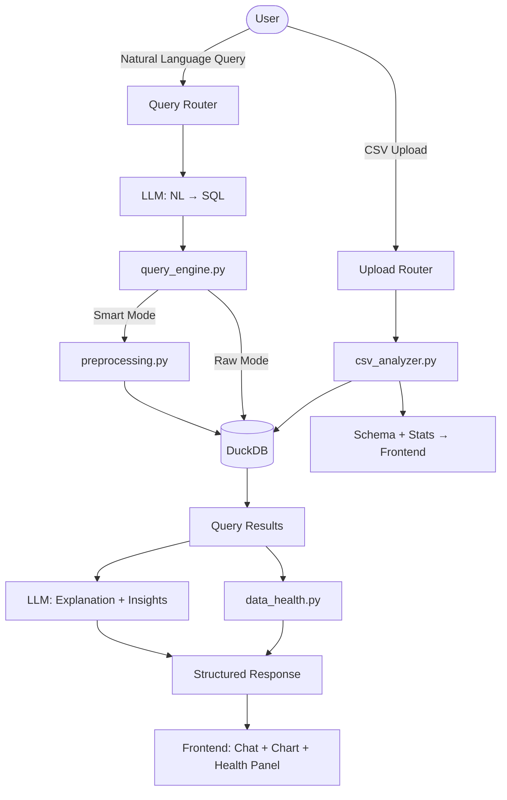

# Talk to Data — AI-Powered CSV Query System

A full-stack "Talk to Data" platform where users upload a CSV, ask questions in plain English, and receive SQL-backed answers with charts, data health panels, and preprocessing transparency.

---

## Tech Stack

| Layer | Technology |
|---|---|
| Backend | Python 3.11 + FastAPI |
| Frontend | React 18 + Vite |
| Data Engine | DuckDB (in-process, fast columnar SQL) |
| LLM | Groq (llama3-70b-8192) |
| Charts | Recharts |
| Styling | Vanilla CSS with glassmorphism design |

---

## Proposed Folder Structure

```
natwest hackathon/
├── backend/
│   ├── main.py                  # FastAPI entry point
│   ├── requirements.txt
│   ├── .env                     # GROQ_API_KEY
│   ├── uploads/                 # Saved CSV files
│   ├── routers/
│   │   ├── upload.py            # POST /upload
│   │   └── query.py             # POST /query
│   ├── services/
│   │   ├── csv_analyzer.py      # Schema extraction, statistics
│   │   ├── query_engine.py      # DuckDB execution layer
│   │   ├── preprocessing.py     # Smart Mode data quality + imputation
│   │   ├── llm_service.py       # Groq: NL→SQL + explanation
│   │   └── data_health.py       # Missing %, outliers, confidence score
│   └── models/
│       └── schemas.py           # Pydantic request/response models
│
└── frontend/
    ├── index.html
    ├── vite.config.js
    ├── src/
    │   ├── main.jsx
    │   ├── App.jsx
    │   ├── index.css            # Global design tokens
    │   ├── components/
    │   │   ├── ChatWindow.jsx   # Main chat interface
    │   │   ├── MessageBubble.jsx
    │   │   ├── UploadPanel.jsx  # CSV drag-and-drop upload
    │   │   ├── ModeToggle.jsx   # Raw / Smart toggle
    │   │   ├── DataHealthPanel.jsx
    │   │   ├── ChartRenderer.jsx # Recharts auto-chart
    │   │   ├── ResultTable.jsx
    │   │   └── InsightBullets.jsx
    │   ├── hooks/
    │   │   └── useChat.js       # Query state, history, context memory
    │   └── api/
    │       └── client.js        # Axios API wrapper
```

---

## Proposed Changes

### Backend

#### [NEW] `backend/main.py`
FastAPI app with CORS, lifespan, mounts upload/query routers.

#### [NEW] `backend/routers/upload.py`
- `POST /upload` — accepts multipart CSV, saves to `uploads/`, runs `csv_analyzer.py`, returns schema + stats.

#### [NEW] `backend/routers/query.py`
- `POST /query` — accepts `{question, mode, session_id, dataset_id}`, orchestrates full pipeline and returns structured response.

#### [NEW] `backend/services/csv_analyzer.py`
- Reads CSV via DuckDB  
- Extracts: column names, inferred types, row count, null %, min/max/mean, sample rows (≤5)  
- **Does NOT send full dataset to LLM — only schema + sample**

#### [NEW] `backend/services/llm_service.py`
- `generate_sql(schema, sample, question, history)` — structured prompt → Groq → extracted SQL  
- `explain_result(sql, result_json, question)` → plain English + bullet insights  
- `why_analysis(sql, result_json, schema)` → root cause explanation (Bonus)

#### [NEW] `backend/services/query_engine.py`
- Loads CSV into DuckDB in-memory  
- Executes SQL safely (read-only, parameterized table refs)  
- Returns rows as list of dicts + column info

#### [NEW] `backend/services/preprocessing.py`
Smart Mode only:
- Computes null % per column  
- Detects outliers via IQR  
- Computes skewness → decides mean vs median imputation  
- Returns preprocessed DuckDB relation + transparency log

#### [NEW] `backend/services/data_health.py`
- Aggregates: missing %, outlier count, rows used, confidence score formula  
- Confidence = `100 - (missing_weight * missing_pct) - (outlier_weight * outlier_pct)`

#### [NEW] `backend/models/schemas.py`
Pydantic models: `UploadResponse`, `QueryRequest`, `QueryResponse`, `DataHealth`, `PreprocessingLog`

---

### Frontend

#### [NEW] `frontend/src/index.css`
Dark glassmorphism design — deep navy palette, purple/teal accents, smooth animations, Google Fonts (Inter).

#### [NEW] `frontend/src/App.jsx`
Root component — two-pane layout: sidebar (upload + metadata) + main chat window.

#### [NEW] `frontend/src/components/UploadPanel.jsx`
- Drag-and-drop CSV upload with animated border  
- Shows schema table after upload (column names, types, null%)  
- File stats badge

#### [NEW] `frontend/src/components/ChatWindow.jsx`
- Scrollable message history  
- Input bar with send button  
- Mode toggle (Raw/Smart) persisted in state

#### [NEW] `frontend/src/components/MessageBubble.jsx`
- User: right-aligned dark bubble  
- Assistant: left-aligned glass card containing:  
  - Explanation text  
  - Bullet insights  
  - ResultTable  
  - ChartRenderer  
  - DataHealthPanel  
  - PreprocessingLog (Smart Mode only)

#### [NEW] `frontend/src/components/DataHealthPanel.jsx`
Visual health card: sparkline bars for missing %, outlier count badge, confidence ring/score.

#### [NEW] `frontend/src/components/ChartRenderer.jsx`
- Auto-selects chart type: line (if date column detected), bar otherwise  
- Uses Recharts  
- Responsive container, animated on mount

#### [NEW] `frontend/src/hooks/useChat.js`
- Maintains `messages[]` array  
- Sends `session_id` for follow-up query context memory (Bonus)  
- Auto-suggests insights after upload

---

## Architecture Flow



---

## API Contract

### `POST /upload`
**Request**: multipart/form-data — `file: CSV`  
**Response**:
```json
{
  "dataset_id": "uuid",
  "filename": "sales.csv",
  "row_count": 5000,
  "columns": [
    { "name": "revenue", "type": "DOUBLE", "null_pct": 8.2, "mean": 12340.5 }
  ],
  "sample": [...]
}
```

### `POST /query`
**Request**:
```json
{
  "dataset_id": "uuid",
  "question": "What is the total revenue by region?",
  "mode": "smart",
  "session_id": "abc123"
}
```
**Response**:
```json
{
  "sql": "SELECT region, SUM(revenue) FROM data GROUP BY region",
  "result": [...],
  "explanation": "The South region leads with $2.4M in revenue...",
  "insights": ["South: +22% vs avg", "North: declining trend"],
  "chart_type": "bar",
  "chart_data": [...],
  "data_health": { "missing_pct": 8.2, "outliers": 3, "rows_used": 4960, "confidence": 89 },
  "preprocessing_log": ["Filled 8.2% nulls in 'revenue' using median (right skew detected)"],
  "mode": "smart"
}
```

---

## Verification Plan

### Automated
- Run `uvicorn backend.main:app --reload` and hit `/docs` Swagger UI  
- Upload test CSV, verify schema extraction  
- Send NL query in both modes, verify SQL + results  

### Browser Test
- Launch Vite dev server, upload CSV drag-and-drop  
- Toggle Raw/Smart, send queries, verify charts and health panel render  

### Manual
- Use Groq API key in `.env`  
- Verify data health confidence score adjusts based on CSV quality
